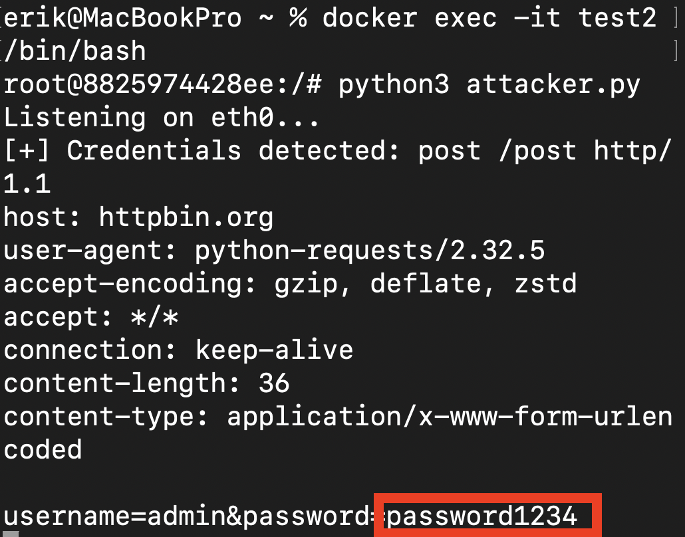

# tor-exit-node-mitm

Educational PoC demonstrating Man-in-the-Middle (MitM) attacks and credential sniffing on Tor exit nodes.  
CAP 6135 Project

> ⚠️ Please use this for educational purposes. The project was created to prove the vulnerability of the Tor exit node in a controlled, custom Docker environment. Please don't use this on the actual Tor environment.

---

## Overview

This POC simulated a man-in-the-middle attack on the custom Tor exit node. To guarantee the routing anonymity, but prove that it doesn't guarantee the data confidentiality. The PoC emphasizes the importance of HTTPS by capturing HTTP traffic at the exit node.

### Key Components

- **`attacker.py`**: It's a Python script for sniffing the TCP traffic at the exit node's network interface.
- **`victim.py`**: It's a Python client script that requests a TOR SOCKS5 proxy to the target server.
- **Dockerized Tor Node**: It's the Debian Sid container that has a single-hop Tor relay to simulate the exit node environment.

---

## Setup & Installation

### Prerequisites

- Docker Desktop
- Python 3.x (Host Machine)
- Essential Python libraries (Host): `requests`, `PySocks`

```bash
pip install requests PySocks
```
---

### 1. Build the Malicious Node - Docker

To have a compatibility with the latest Tor consensus, we need to install the latest Debian image and install the dependent package. We assume that the container name is `test2` in Docker.

**Terminal 1: Container Configuration**

```bash
# Executing the Container
docker run --name test2 -it -p 9050:9050 -p 9001:9001 debian:sid /bin/bash

# Install and update the tools inside of the container
apt-get update && apt-get install -y tor python3 python3-pip nano procps libpcap0.8

# Install Scapy
pip3 install scapy --break-system-packages
```

---

### 2. Configure the Tor Relay

To allow connection with outside and single-hop, we change the `/etc/tor/torrc` configuration file.

Inside of Terminal 1:

```bash
printf "DataDirectory /var/lib/tor\nSocksPort 0.0.0.0:9050\nORPort 9001\nExitRelay 1\nExitPolicy accept *:*\nPublishServerDescriptor 0\nAllowSingleHopCircuits 1\nLog notice stdout\n" > /etc/tor/torrc
```

---

## Execution Guide

### Stage 1: Start the Tor Service

From the Terminal 1 that is logged in with root access, configure the privilege and start the tor service.

```bash
chown -R root:root /var/lib/tor
tor -f /etc/tor/torrc
```

> Please wait until you see the message **"Bootstrapped 100%: Done"**, keep this terminal and leave the window open.

---

### Stage 2: Create & Launch the Attacker

Open a new terminal (Terminal 2) on the host machine.

**Terminal 2** — Log in to the executed container:

```bash
docker exec -it test2 /bin/bash
```

Create the `attacker.py` using nano editor inside of the container:

```bash
nano attacker.py
```

Copy the `attacker.py` code that is uploaded on the GitHub and save it (`Ctrl+O`, `Enter`) and exit (`Ctrl+X`).

Execute the sniffer:

```bash
python3 attacker.py
```

> Now the script is listening to the container interface's traffic.

---

### Stage 3: Launch the Victim

Inside of the host machine open another terminal (Terminal 3).

**Terminal 3 (Host Machine):**

```bash
# Execute the victim.py
python3 victim.py
```

---

## Proof of Concept


> Picture: Successful interception of credentials sent over Tor.
